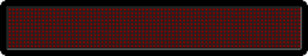
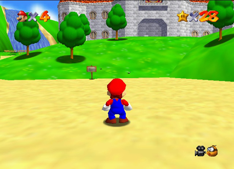

# Problem Modeling and User Stories

## Learning Objectives

- Given a desired end-result, identify the bare minimum attributes necessary to make that end-result appear to have been met.
- Convert user stories into actionable pseudocode.

## Framing

**"Where Do I Start?"** That's one of the most common questions instructors are asked during the first few weeks of WDI. As a new developer, it's not necessarily easy to take an exercise or project prompt and take the first few steps towards completing it.

Today's class is all about developing the mindset required to answer that question. In particular, we're going to be breaking down problems into smaller parts and using those to guide the planning and development process.

**This is going to be a code-free "think like a programmer" class.** Please close your computers. You will not need them for the duration of the class.

## Exploration 1: Button (5 minutes / 0:05)

[Display this page.](http://ga-wdi-lessons.github.io/user-stories-and-problem-modeling/examples/button.html)

<details>
  <summary>What are we looking at?</summary>

  > A button being pushed.

</details>

<details>
  <summary>Are we looking at a <em>real life</em> button being pushed?</summary>

  > Obviously not.

</details>

<details>
  <summary>So how do you know it's a button?</summary>

  - It's red
  - It's round
  - It's shaded
  - It says "push"

</details>

### You Do: Clicking The Button

> 2 minute exercise. 3 minutes review.

With the people at your table, identify what *specifically* tells you when the button has been "pushed".

<details>
  <summary><strong>Some examples...</strong></summary>
  <br/>

  - The bottom border shrinks
  - The top border grows
  - The background color darkens
  - The text moves down a little

</details>

## Re-framing (5 minutes / 0:10)

We try to code things that reflect the real world. Here we create a pushed button that isn't actually a button. Apple makes our computer into a workstation by giving it a desktop and folders.

The more you try to stay in reality when coding, the more difficult coding can become. This is the same with writing books and poetry and painting: if you try to be 100% realistic, you will never finish.

Good developers strike a balance: they provide the bare minimum code necessary to create a sense of a specific reality.

## Faking It (10 minutes / 0:20)

Sometimes that means "faking it." By that we mean giving the user the sense that we've replicated a real-life experience when, relatively speaking, we've actually done very little. Take Google Maps for example...

[Display General Assembly on Google Maps.](https://www.google.com/maps/place/General+Assembly+Washington+DC/@38.9048728,-77.0339908,17z/data=!4m2!3m1!1s0x89b7b7bfc2a12169:0x21c1233b00cff054)

### What is south of this image?

In real life, the answer is the White House. In the computer world, the answer is "nothing".

We have a perception of moving around a map, like we would in real life. But to have the entire world map loaded would take impossible amounts of memory.

What's *really* happening is that Google is showing a tiny portion of the world map. When the user clicks and drags the mouse a certain amount, Google loads an additional tiny portion of the map.

### The text on this sign isn't *actually* moving.



Small lights are turning on and off in a way that creates the illusion of moving.

### What's Behind Mario?



Nothing. Not even nothing. That's like asking what's outside our Universe.

If we turn Mario around, sure, there appears to be something behind him because we turned him around! But there just pixels on a screen that render based on actions.

The view of Mario's universe is created as it's necessary.

With computers, if a tree falls in a forest and no-one's around to hear it, it really *doesn't* make a sound. It doesn't even exist!

### Computers are just little boxes of lights


What we're ultimately doing as web developers is arranging little pixels of light in the browser so that they appear as something of value to the user.

## Exploration 2: Flying

[Display this page.](http://ga-wdi-lessons.github.io/user-stories-and-problem-modeling/examples/flying.html)

### You Do (10 minutes / 0:30)

> 5 minutes exercise. 5 minutes review.

With your table answer these questions...

- What are we looking at?
- What's the nearest thing on the page? Furthest?
- What visual cues tell you what each thing is?
- As literally and technically as possible, describe what's happening on this page.

### Reflection

<details>
  <summary><strong>Some thoughts...</strong></summary>
  <br/>

  - The clouds are perceived as clouds because they are round and white. They appear to be at different distances because of size and opacity. They appear to be moving because we are changing their position on the page from left to right.
  - The bird is a bird because of its (literal) v-shape and it is flying because its vertical position on the page goes from up to down.
  - Together, the first two bullet points create the illusion that a bird is flying through the sky. There is, of course, nothing in our code that alludes to the notion of a bird or sky.

  <br/>
</details>

## Exploration 3: If it looks like a duck...
[Display this page.](http://ga-wdi-lessons.github.io/user-stories-and-problem-modeling/examples/duck.html)

### You Do (5 minutes / 0:35)

> 3 minutes exercise. 2 minutes review.

With your table, discuss...

- Which of these looks most like a duck?
- What do the duck-looking ones have in common?

### You Do (5 minutes / 0:40)

> 3 minutes exercise. 2 minutes review.

Once again with your table, discuss...

- What are the minimum requirements for something to look like a duck?

### Reflection

<details>
  <summary><strong>Some thoughts...</strong></summary>
  <br/>

  - While we all had initial thoughts as to which image looks most duck-like, we were able to come to an agreement on a certain set of properties that, if met, would qualify something to look like a duck.
  - We could add other properties -- feathers, plumage, a quack -- to make something look even more like a duck. But they are not essential for something to qualify as duck-like.

  <br/>
</details>

## User Stories (10 minutes/ 0:50)

In "Agile" methodology, user stories describe every sequence of events a user may encounter when working with your app.

You brainstorm a bunch of user stories, and then select the ones that are most essential. When a user can complete all of these stories using your app, your app is considered complete.

Then, you can create additional user stories.

> This strongly correlates to test-driven development (TDD), which you will learn about this afternoon.

**You just created some tentative user stories for a duck.** That is: you defined what a user should experience in your creation in order for it to be considered a "complete" duck.

The convention that developers like to follow for user stories looks like this example of a Facebook user story...

```
As a user, I want to update my status, so that my friends and family can see what I'm thinking or doing.
```

Or this format...

```
As a <role>, I want to <goal>, so that <reason>
```

As a general rule, user stories should be as granular and specific as possible. A bad example:

```
This application should have a really good social networking component.
```

## BREAK (10 minutes / 1:00)

## *User* stories versus *code* stories (10 minutes / 1:10)

User stories describe what the user should be able to do. User stories **do not say anything about code.** "Code stories" is pseudocode.

<details>
  <summary><strong>Q. Why should you write user stories before you write code stories?</strong></summary
  <br/>

  > What's most important in a program is its perception by other people. What's second-most important -- although still very important -- is your code. We need to anticipate users' needs as we code.

  <br/>
</details>

## We Do: User-to-Code Stories for Concentration (20 minutes / 1:30)

[Concentration](http://www.mathsisfun.com/games/memory/)

**Spend two minutes creating some user stories for Concentration.** Then we'll go over them together.

<details>
  <summary><strong>Some example user stories for Concetration are...</strong></summary>

  <br/>

  - As a user, I want to see all cards starting face down, so that I can pick from any card.
  - As a user, I want to click on a card and see the front, so that I can look for matching cards.
  - As a user, I want to flip over a second card, so the I can try to get a match with the first.
  - As a user, I want to see my matches remain flipped face up, so that I can focus on the remaining cards.

</details>
<br/>

Now we'll start moving these user stories toward being code stories. To do this, We'll define some key *things* and *actions* in my user stories. For each one, we need to consider what the bare minimum is to achieve this effect...

| User story | Code story |
| --- | --- |
| Begins a game | The page loads |
| Card | A div |
| Face-down | The div has no text/image |
| Face-up | The div has text/image |
| Turn over | A card is clicked |
| Match | Two divs have the same text/image |
| Leaves them | Nothing happens |

Using this table, our first user story...

> As a user, I want to see all cards starting face down, so that I can pick from any card.

...looks like this as a code story...

> As a user, when the page loads all `<div>`s should not be displaying text/image, so that I can click on any `<div>`.

### Tips for User-to-Code Stories

- If a user story is "nothing happens", it has no code story. There is no code for "nothing happens".
- Your first instinct to make a div go from "has text" to "no text" may be to delete the text. But deleting and then replacing data is time-consuming and annoying. Why not just hide the div's text?
- Similarly, your first instinct to make a click go from "does something" to "does nothing" may be to remove its event listener. But deleting and replacing event listeners is time-consuming and annoying. Why not just put an `if` inside the event listener so it always fires, but only does stuff under certain conditions?

With this in mind, our user stories become...

- When the user loads the page, the values on all divs are hidden
- If the user clicks on a div with a hidden value, the value is revealed
- If the values of two divs are revealed, and their values are not the same, their values are hidden

Now I can turn my user stories into pseudocode. I'll use "when" for events, which will remind me to use event listeners...

```
When the page loads, the values on all divs are hidden
When a div is clicked
  If its value is hidden
    Its value is revealed
    If another div is already revealed
      If the other revealed div has a different value
        Both revealed divs' values are hidden
```

### Keywords

These are some keywords you might find yourself writing in your user stories and pseudocode. I've taken a stab at what their counterparts in "real" code might be.

Take these with a grain of salt: there are many, many more ways to "hide" something than with `display:hide`.

| English | Code |
| --- | --- |
| when | `addEventListener(event, doWhat)` |
| every so often | `setInterval(doWhat, howOften)` |
| if | `if` |
| otherwise | `else` |
| all of | `collection.forEach` |
| I have | `var x =` |
| It has | `object.property =` |
| It can | `object.method = function(){}` |
| Nothing happens | `...` |
| show | `display: block` |
| hide | `display: none` |
| a / an | `object` `{}` |
| plural(s) | `array` `[]` |

## Keep in mind...


#### There is no owl.

There's no right way to do user stories. Their purpose is...
- To help you flesh out ideas
- To help you streamline your coding process and avoid unnecessary work
- To help you communicate what you're doing to non-coders

If your method of writing user stories isn't doing any of those, do it differently.

> While there is certainly no specific "right" way. There are certainly wrong ways to do user stories, which will fail to communicate your ideas, and fail to help you scope and understand your development efforts. Remember the guidelines from earlier in the lesson plan.

## Not the Olympics - Bronze/Silver/Gold

In the Olympics, we strive for gold. In agile software devlopment, we strive for the bronze in order to reach the gold. That is not to say we set low expectations for ourselves. But rather, the gold should be just be an extension of the bronze achievement.

### MVP - Minimum Viable Product

The version of a new product which allows a team to collect the maximum amount of validated learning about customers with the least effort.

[Minimum Viable Product](https://www.youtube.com/watch?v=1FoCbbbcYT8)

In the context of the WDI student, MVP is a bit different, but there are a lot of things that correlate. Create a product that does what the prompt asks you. Whatever that takes, get the thing to work the way you intended first. Then add features and other cool things!

### Bronze - Your MVP

The bare necessities to be functional and meet requirements.
- In WDI: does it meet the criteria for the project?
- In the real world: does it meet the business requirements in order to start an effective feedback loop?

### Silver

Improve user experience
- In WDI: One cool feature! Enhancing what you learned in class.
- In the real world: What can we push to the next iteration? Where can we add value?

### Gold

"Nice-to-haves"
- In WDI: push beyond what you've learned in class.
- In the real world: next steps to maximize ROI.

> In the real world, individual items under any of the above categories may have their own bronze, silver and gold subdivisions.

In WDI, we're trying to get that MVP during project week as soon as possible. So that we can start to think about improvements and polishing. That is not to say that we should rush the bronze. Make sure that the code is well written, maintainable, and functional before thinking about moving to the Silver implementation.

When we start to write user stories, break these user stories in these three categories.

## You Do: User Stories for ATM (15 minutes / 1:45)

> 10 minutes exercise. 5 minutes review.

[ATM application](https://github.com/ga-wdi-exercises/atm)

## Wireframing

A wireframe is a blueprint/sketch/visual outline of the components of your website. Though there are some great digital wireframing tools out there, all you really need to make a wireframe for your personal use is pen and paper.

- Curious to learn more about wireframes? Ask a UXDI student!
- Checkout [this tutorial](http://webdesign.tutsplus.com/articles/a-beginners-guide-to-wireframing--webdesign-7399) on wireframing
- Also checkout [these resources](http://mashable.com/2010/07/15/wireframing-tools/#y96DOFsQZgqb) if you want a free tool for wireframing if you don't like paper and pen.

## Scheduling

When planning these sprints, set concrete goals for yourself. I'm going to achieve X by 12:30 so that I can get started on Y after lunch. I will finish Y by close of business so that I can start on Z. You could scale even further than that.

## You Do: User Stories For Your Project (10 minutes)

<!-- AM: Is it okay to give them the prompt for Project 1? -->
<!-- AM: Maybe can not say it's for Project 1 but list the actual prompts. -->

## Resources

- [Further "faking it" with old school graphics](https://www.youtube.com/watch?v=Tfh0ytz8S0k): A fascinating YouTube video
- [Making of Crash Bandicoot](http://all-things-andy-gavin.com/2011/02/04/making-crash-bandicoot-part-3/): How they faked the first 3D gaming world
- [How to wireframe](https://www.gliffy.com/uses/wireframe-software/)
